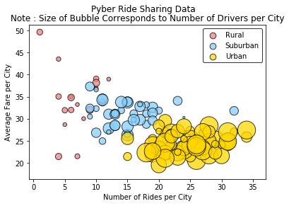
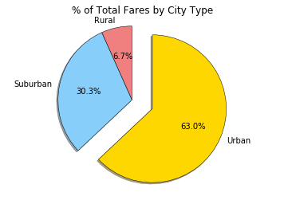
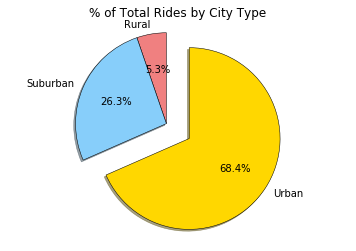
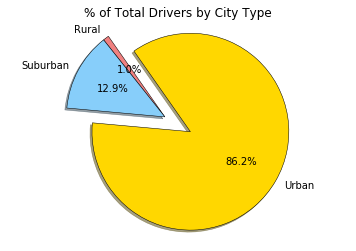

```python
# Dependencies
import pandas as pd
import numpy as np
import matplotlib.pyplot as plt
import seaborn as sns
import os
```


```python
# import file using pandas

city_data = os.path.join('raw_data', 'city_data.csv')
ride_data = os.path.join('raw_data', 'ride_data.csv')

city_df = pd.read_csv(city_data)
ride_df = pd.read_csv(ride_data)

#drop one duplicate record with same city name, same ride_ids but different # of drivers
city_df = city_df.drop_duplicates('city', keep = 'first')

#merge
merged_df = city_df.merge(ride_df, on = 'city')
```


```python
merged_df.head
```


    <bound method NDFrame.head of                 city  driver_count   type                 date   fare  \
    0         Kelseyland            63  Urban  2016-08-19 04:27:52   5.51   
    1         Kelseyland            63  Urban  2016-04-17 06:59:50   5.54   
    2         Kelseyland            63  Urban  2016-05-04 15:06:07  30.54   
    3         Kelseyland            63  Urban  2016-01-25 20:44:56  12.08   
    4         Kelseyland            63  Urban  2016-08-09 18:19:47  17.91   
    5         Kelseyland            63  Urban  2016-10-24 15:15:46  33.56   
    6         Kelseyland            63  Urban  2016-06-06 13:54:23  20.81   
    7         Kelseyland            63  Urban  2016-08-10 07:02:40  44.53   
    8         Kelseyland            63  Urban  2016-07-05 17:37:13  29.02   
    9         Kelseyland            63  Urban  2016-04-25 02:18:31  20.05   
    10        Kelseyland            63  Urban  2016-01-25 08:47:09   9.29   
    11        Kelseyland            63  Urban  2016-11-10 01:57:14  20.58   
    12        Kelseyland            63  Urban  2016-08-15 11:55:02  27.45   
    13        Kelseyland            63  Urban  2016-08-01 10:51:49  33.51   
    14        Kelseyland            63  Urban  2016-04-13 12:07:08   6.56   
    15        Kelseyland            63  Urban  2016-01-12 22:51:21  20.19   
    16        Kelseyland            63  Urban  2016-05-31 01:05:31  35.22   
    17        Kelseyland            63  Urban  2016-07-13 16:53:07  10.31   
    18        Kelseyland            63  Urban  2016-01-07 07:15:41  11.45   
    19        Kelseyland            63  Urban  2016-04-09 13:17:27  27.85   
    20        Kelseyland            63  Urban  2016-06-30 01:59:04   8.27   
    21        Kelseyland            63  Urban  2016-04-20 05:36:59  31.67   
    22        Kelseyland            63  Urban  2016-05-02 05:55:28  40.92   
    23        Kelseyland            63  Urban  2016-06-22 06:54:57  12.58   
    24        Kelseyland            63  Urban  2016-06-18 06:03:03  16.77   
    25        Kelseyland            63  Urban  2016-01-09 20:28:56  27.21   
    26        Kelseyland            63  Urban  2016-07-22 19:28:21  35.71   
    27        Kelseyland            63  Urban  2016-11-26 02:34:57  15.49   
    28        Nguyenbury             8  Urban  2016-07-09 04:42:44   6.28   
    29        Nguyenbury             8  Urban  2016-11-08 19:22:04  19.49   
    ...              ...           ...    ...                  ...    ...   
    2345     East Leslie             9  Rural  2016-04-13 04:30:56  40.47   
    2346     East Leslie             9  Rural  2016-04-26 02:34:30  45.80   
    2347     East Leslie             9  Rural  2016-04-05 18:53:16  44.78   
    2348     East Leslie             9  Rural  2016-11-13 10:21:10  15.71   
    2349     East Leslie             9  Rural  2016-03-06 06:10:40  51.32   
    2350     East Leslie             9  Rural  2016-03-04 10:18:03  13.43   
    2351     East Leslie             9  Rural  2016-11-28 09:09:15  37.76   
    2352     East Leslie             9  Rural  2016-09-08 19:19:38  30.59   
    2353     East Leslie             9  Rural  2016-03-02 22:09:34  36.61   
    2354     East Leslie             9  Rural  2016-06-22 07:45:30  34.54   
    2355  Hernandezshire            10  Rural  2016-02-20 08:17:32  58.95   
    2356  Hernandezshire            10  Rural  2016-06-26 20:11:50  28.78   
    2357  Hernandezshire            10  Rural  2016-01-24 00:21:35  30.32   
    2358  Hernandezshire            10  Rural  2016-03-05 10:40:16  23.35   
    2359  Hernandezshire            10  Rural  2016-04-11 04:44:50  10.41   
    2360  Hernandezshire            10  Rural  2016-06-26 11:16:28  26.29   
    2361  Hernandezshire            10  Rural  2016-11-25 20:34:14  38.45   
    2362  Hernandezshire            10  Rural  2016-11-20 17:32:37  26.79   
    2363  Hernandezshire            10  Rural  2016-02-24 17:30:44  44.68   
    2364       Horneland             8  Rural  2016-07-19 10:07:33  12.63   
    2365       Horneland             8  Rural  2016-03-22 21:22:20  31.53   
    2366       Horneland             8  Rural  2016-01-26 09:38:17  21.73   
    2367       Horneland             8  Rural  2016-03-25 02:05:42  20.04   
    2368  West Kevintown             5  Rural  2016-11-27 20:12:58  12.92   
    2369  West Kevintown             5  Rural  2016-02-19 01:42:58  11.15   
    2370  West Kevintown             5  Rural  2016-03-11 09:03:43  42.13   
    2371  West Kevintown             5  Rural  2016-06-25 08:04:12  24.53   
    2372  West Kevintown             5  Rural  2016-07-24 13:41:23  11.78   
    2373  West Kevintown             5  Rural  2016-06-15 19:53:16  13.50   
    2374  West Kevintown             5  Rural  2016-02-10 00:50:04  34.69   
    
                ride_id  
    0     6246006544795  
    1     7466473222333  
    2     2140501382736  
    3     1896987891309  
    4     8784212854829  
    5     4797969661996  
    6     9811478565448  
    7     1563171128434  
    8     6897992353955  
    9     1148374505062  
    10     213692794373  
    11    3395682132130  
    12    8456148871668  
    13    6610565660737  
    14    8101498434215  
    15    3054122642867  
    16    5946467060438  
    17    2180910323678  
    18     600800386573  
    19    5748868894243  
    20    4384089549855  
    21    2865704421982  
    22    2769007541388  
    23    6629798205387  
    24    7223504701591  
    25     831362906446  
    26    1234880130185  
    27    5187807155760  
    28    1543057793673  
    29    1702803950740  
    ...             ...  
    2345  7075058703398  
    2346  9402873395510  
    2347  6113138249150  
    2348  7275986542384  
    2349  6841691147797  
    2350  8814831098684  
    2351   804829686137  
    2352  8211833105097  
    2353  5500269118478  
    2354   684950063164  
    2355  3176534714830  
    2356  6382848462030  
    2357  7342649945759  
    2358  7443355895137  
    2359  9823290002445  
    2360   304182959218  
    2361  2898512024847  
    2362  3095402154397  
    2363  6389115653382  
    2364  8214498891817  
    2365  1797785685674  
    2366  5665544449606  
    2367  5729327140644  
    2368  6460741616450  
    2369  8622534016726  
    2370  4568909568268  
    2371  8188407925972  
    2372  2001192693573  
    2373  9577921579881  
    2374  9595491362610  
    
    [2375 rows x 6 columns]>


```python
#group be city name
by_city = merged_df.groupby('city')

# var holding avg fare by city
avg_fare = by_city.mean()['fare']

#var holding rides by city
ride_count = by_city['ride_id'].count()

# num of drivers
driver_count = by_city.mean()['driver_count']

# city type data
city_type = city_df.set_index('city')['type']

# dataframe from above series
city_info = pd.DataFrame({
    "Number of Rides": ride_count,
    "Average Fare": avg_fare,
    "Number of Drivers": driver_count,
    "Type of City": city_type
})


city_info.sort_values('Number of Drivers', ascending = False)

#separated dfs for city categories
rural = city_info[city_info['Type of City'] == 'Rural']
suburban = city_info[city_info['Type of City'] == 'Suburban']
urban = city_info[city_info['Type of City'] == 'Urban']

#Color Dictionary
color_scheme = {'Gold':'#FFD700', 'Light Sky Blue':'#87CEFA', 'Light Coral':'#F08080'}
city_color = {'Urban': color_scheme['Gold'], 'Suburban': color_scheme['Light Sky Blue'], 'Rural': color_scheme['Light Coral']}

plt.suptitle('Pyber Ride Sharing Data')

# three scatter plots for each city type
plt.scatter(rural['Number of Rides'], rural['Average Fare'], s = rural['Number of Drivers']*10, color = city_color['Rural'], edgecolor = 'black', label = 'Rural', alpha = .75)
plt.scatter(suburban['Number of Rides'], suburban['Average Fare'], s = suburban['Number of Drivers']*10, color = city_color['Suburban'], edgecolor = 'black', label = 'Suburban', alpha = .75)
plt.scatter(urban['Number of Rides'], urban['Average Fare'], s = urban['Number of Drivers']*10, color = city_color['Urban'], edgecolor = 'black', label = 'Urban', alpha = .75)

#print scatter plot
plt.title('Note : Size of Bubble Corresponds to Number of Drivers per City')
plt.xlabel('Number of Rides per City')
plt.ylabel('Average Fare per City')


lgnd = plt.legend(frameon = True, edgecolor = 'black')
lgnd.legendHandles[0]._sizes = [75]
lgnd.legendHandles[1]._sizes = [75]
lgnd.legendHandles[2]._sizes = [75]

plt.show()
```





```python
#group by type to be used by all pie charts
by_city_type = merged_df.groupby('type')['type', 'fare', 'ride_id', 'driver_count']

#total fare by city
fare_sum = by_city_type.sum()['fare']

#pie chart build
labels = fare_sum.index

#colors and exploe the same for all pie charts, reference here
colors = [city_color[n] for n in labels]
explode = [0 , 0, .3]
plt.pie(fare_sum, startangle = 90, colors = colors, explode = explode, labels = labels, autopct = "%1.1f%%", shadow = True, wedgeprops = {'linewidth': .5, 'edgecolor': 'black'})

#pie chart display
plt.title('% of Total Fares by City Type')
plt.axis('equal')
plt.show()
```





```python
# number of ride per city type
ride_city_sum = by_city_type.count()['ride_id']

labels = ride_city_sum.index
plt.pie(ride_city_sum, startangle = 90, explode = explode, colors = colors, labels = labels, autopct = "%1.1f%%", shadow = True, wedgeprops = {'linewidth': .5, 'edgecolor': 'black'})
plt.title('% of Total Rides by City Type')
plt.axis('equal')
plt.show()
```





```python
# of driver per city type
driver_city_sum = by_city_type.sum()['driver_count']

labels = driver_city_sum.index
plt.pie(driver_city_sum, startangle = 125, explode = explode, colors = colors, labels = labels, autopct = "%1.1f%%", shadow = True, wedgeprops = {'linewidth': .5, 'edgecolor': 'black'})
plt.title('% of Total Drivers by City Type')
plt.axis('equal')
plt.show()
```




